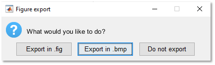

# EEG Time-frequency analysis scripts

The MATLAB scripts in this repository enable to compute EEG time-frequency decomposition using Morlet Wavelet transform as well as robust permutation-based statistical analyses with Threshold-Free Cluster Enhancement (TFCE) to account for multiple comparisons correction.

**⚠️ OF NOTE: The analysis script can currently only import .set EEG files (see [EEGLAB](https://github.com/sccn/eeglab)).**

## Table of Contents
* [Getting Started](#getting-started)
  + [1.TimeFreq_Design.m](#1timefreq-designm)
    - [1.1. Settings](#11-settings)
    - [1.2. Inputs ERP](#12-inputs-erp)
    - [1.3. Design Definition](#13-design-definition)
    - [1.4. Save Design Variables](#14-save-design-variables)
    - [1.5. Frequency Bands Definition](#15-frequency-bands-definition)
    - [1.6. Save Frequency Bands Variables](#16-save-frequency-bands-variables)
    - [1.7. Import TF Decomposition](#17-import-tf-decomposition)
    - [1.8. Upper folder containing all EEG files](#18-upper-folder-containing-all-eeg-files)
    - [1.9. Save folder](#19-save-folder)
  + [2.TimeFreq_Main.m](#2timefreq-mainm)
  + [3.TimeFreq_Figures.m](#3timefreq-figuresm)
* [Dependencies](#dependencies)
* [Author](#author)
* [License](#license)
* [Acknowledgements](#acknowledgements)
* [Fundings](#fundings)

<small><i><a href='http://ecotrust-canada.github.io/markdown-toc/'>Table of contents generated with markdown-toc</a></i></small>


## Getting Started

When on the [TimeFreq startup page](https://github.com/CorentinWicht/TimeFreq), start by clicking on `⬇️ Code` on the top right of the screen and then `Download ZIP` to download the whole repository (alternatively you can also clone it). 
Then, you will need to run the scripts **in the following order**:

```
1.TimeFreq_Design.m
2.TimeFreq_Main.m
3.TimeFreq_Figures.m (optional and still in development)
```

You will find below a step by step explanation on how to run each script in MATLAB (by clicking on the `▶️ Run` button or on your keyboard's button `⌨️ F5`).


### 1.TimeFreq_Design.m

This script is crucial to the proper functioning of the analysis. 

The 9 prompts below will appear sequentially and each prompt will already be filled with default settings and/or examples on how they should be filled: 


#### 1.1. Settings


The first prompt enables to set up parameters regarding the time-frequency decomposition.

You can decide to compute 1) `Evoked activity`, 2) `Induced activity` and/or 3) `Intertrial coherence`.\
For a deeper understanding between these three measures see:\
* [Herrmann, C.S., Rach, S., Vosskuhl, J. et al. Time–Frequency Analysis of Event-Related Potentials: A Brief Tutorial. Brain Topogr 27, 438–450 (2014)](https://doi.org/10.1007/s10548-013-0327-5)
* [Herrmann, C. S., Grigutsch, M., & Busch, N. A. (2005). EEG oscillations and wavelet analysis. In T. C. Handy (Ed.), Event-related potentials: A methods handbook (pp. 229-259). Cambridge, MA: MIT Press.](https://www.researchgate.net/publication/38135661_EEG_Oscillations_and_Wavelet_Analysis)

Additionally, you can either import a `TimeFreq_Design.mat` and/or a `TimeFreq_Bands.mat` files (Y)  or create new ones (N).

Finally, you can decide to :
```
* Average reference your EEG files before the time-frequency decomposition
* Restrict the time-window for statistics inside the time-range of your ERP
* Apply a power spectrum normalization as routinely performed by EEGLAB (i.e. 10 x Log10)
```


#### 1.2. Inputs ERP


The second prompt enables to define EEG files-specific settings.

Hence, you will have to provide the prompt with:
```
* The sampling rate of your EEG files (all files should have the same sampling rate)
* The 1) lowest and 2) highest frequency of interest for the time-frequency decomposition 
* The number of permutations to compute robust, non-parametric statistics (i.e. the higher the number of permutations, the slower the computation)
* The alpha threshold for statistics
* The relative tolerance level (also called Epsilon), for additional information see:
```
[D. Iatsenko, P. V. E. McClintock and A. Stefanovska, Linear and synchrosqueezed time-frequency representations revisited: Overview, standards of use, reconstruction, resolution, concentration, and algorithms, Dig. Signal Proc. 42, 1-26 (2015)](https://doi.org/10.1016/j.dsp.2015.03.004)


#### 1.3. Design Definition


The third prompt enables the definition of the statistical design.

These are the designs that are currently accepted:
```
* 1 between-subjects factor
* 1 within-subjects factor
* 1 between- & 1 within-subjects factors
* 2 between-subjects factors
```
There can only be **up to 2 levels for each factor !**

There is already an example that shows you how to fill the first two columns, namely on the... :
```
* First line you should indicate whether Factor1 is a Between-subjects (B) or Within-subjects (W) factor
* Second line you should give a name to the Factor
* Third and fourth lines you need to define the name of each levels.\
```
**The last point is case-sensitive since the name you pick as levels should match either a pattern in your EEG files or the name of subfolders in which you separated the files.**

Additionally, you have the possibility to ignore specific `folder(s)` and/or `file(s)` that are inside the EEG files-containing upper folder.\
For example, if you would like to ignore every EEG files that contains the pattern `_EXCLUDE`, just write this pattern in the first box under the `IgnoreFiles` header.

**Once you are done, press on the cross `X` on the top-right corner and the code will resume**


#### 1.4. Save Design Variables


The fourth prompt asks you to provide a path were to save the **TimeFreq_Design.mat** file containing the design definition variables (can be directly re-imported next time).


#### 1.5. Frequency Bands Definition


The fifth prompt enables to defined up to twelve frequency bands of interest. 

For each band of interest, you need to provide a name in the first column `Bands` and then the lower and upper frequency bounds for that band in the `Boundaries` column. 

**Once you are done, press on the cross `X` on the top-right corner and the code will resume**


#### 1.6. Save Frequency Bands Variables


The sixth prompt asks you to provide a path were to save the **TimeFreq_Bands.mat** file containing the frequency bands definition variables (can be directly re-imported next time).


#### 1.7. Import TF Decomposition


The 7th prompt enables you to import a time-frequency decomposition previously generated by the second script.

Since the decomposition requires heavy computation and is, de facto, time-consuming, you can decide to reimport the decomposition if you just want to perform the statistics separately (in this case press `Yes`).


#### 1.8. Upper folder containing all EEG files


The 8th prompt requires you to indicate the most upper folder containing all your EEG data files (with .set extension).


#### 1.9. Save folder


The last prompt requires you to indicate the folder in which you want to save all the outputs.


Once you are done with this last prompt, the script will generate a `TimeFreq_Param.mat` file containing all the parameters necessary for the second script.

You can now run the second script. 


### 2.TimeFreq_Main.m

This second script is the one running the time-frequency decomposition as well as computation of statistics.

Depending on your design and your hardware the computation might take several days. 

Again, click on the `▶️ Run` button or on your keyboard's button `⌨️ F5` to run the script.\
You don't need to provide any additional information, it will automatically import the parameters that were exported by the [first script](# 1.TimeFreq_Design.m). 

Once the compution is finished there will be a message in MATLAB Command Window:

```
The script is done!
```

The data are saved based on your Current Folder location (i.e. run `pwd` in MATLAB Command Window to know where is the working directoy) accordingly:

```
📁 [Save Folder]
 ↳ 📁 [Exports_DD-MM-YY_HHMM]
    ↳ 📁 [Raw] 
       ↳ 💾 RawTFData.mat
    ↳ 📁 [Stats]
       ↳ 💾 ActivityType_TaskName_Condition_FrequencyBand.mat (e.g. Induced_GoNoGo_CR_Theta.mat)
    ↳ 📋 TimeFreqlog_DD-MM-YY_HHMM.txt
    ↳ 📋 Analyses_DD-MMM-YYYY_HHMM.xlsx
    
------------------------------------------------------------------         
TaskName      = Names of the folder containing your files
Condition     = Names of the levels of the WS factor or of subfolers inside the main folder
FrequencyBand = Names that you gave to the frequency bands of interest
DD-MM-YY_HHMM = Date and time of analysis
------------------------------------------------------------------  
```

| FILES | Content |
| ------ | ------ |
|RawTFData.mat|Matlab data file including one variable for each type of time-frequency metric (e.g. Induced). Each variable is a meta-structure containing substructures for each Task, Condition, etc. (depending on your design). Finally, you will find two substructures "Data" and "Freqs" wich include matrices for, resp. the time-frequency decomposition and the list of frequency bins for each EEG data file included in the analysis|
|ActivityType_TaskName_Condition_FrequencyBand.mat|Matlab data file containing two substructures "TFCE" and "Clusters". The "TFCE" one includes N substructures depending on your design (e.g. 3 substructures for a 2x2 design). Inside each design-specific structure there are 4 matrices: 1) "Obs" = F/T-values \| 2) "TFCE_Obs" = TFCE-corrected F/T-statistics \| 3) "maxTFCE" = Maximum TFCE value for each permutation map \| 4) "P_Values" =  TFCE thresholded P_values|
|TimeFreqlog_DD-MM-YY_HHMM.txt|Text file summarizing each selected parameters for one particular analysis|
|Analyses_DD-MMM-YYYY_HHMM.xlsx|Excel file containing the results of the statistical comparisons (i.e. Cluster threshold, number of significant clusters, etc.)|

### 3.TimeFreq_Figures.m

*This last script is currently still under construction and the creation of figures might crash for some designs.\
Any contribution is thus more than welcome.*

Once more, click on the `▶️ Run` button or on your keyboard's button `⌨️ F5` to run the script.

The 3 settings-related prompts below will appear sequentially: 


You first need to indicate which excel file you would like to load (i.e. Analyses*_DD-MMM-YYYY_HHMM*.xlsx).


Then you will be prompted to indicate the path of the **Stats** folder.


Finally, you will be asked to provide the path of the MATLAB matrix containing the time-frequency decomposition (i.e. RawTFData.mat)


Additionally, X figures-related prompts will appear as follows: 


This prompt enables you to decide which of the MATLAB built-in [ColorMap](https://ch.mathworks.com/help/matlab/ref/colormap.html) to use and to adjust related parameters.


Moreover, if you leave the first and/or the second line of the previous prompt empty, you can create your own ColorMap.




The prompt will ask you whether you'd prefer to export your figure in MAT .fig format, in .bmp or do not export it at all.


At last, this prompt requires you to indicate whether you are satisfied with your choices.\
If yes, they will be applied to all the figures, while if you press no the script runs again for the same figure until you find settings that will suit your needs.


**Of note**, if the statistics on your dataset doesn't return any significant results, this script will run normally but no outputs will be generated.\
On the contrary if there are significant clusters, you will find your figures in the following folder:

```
📁 [Export Folder]
 ↳ 📁 [Exports_DD-MM-YY_HHMM]
    ↳ 📁 [Figures] 
       ↳ 📊 ActivityType_TaskName_Condition_TFCE_FrequencyBand.Extension (e.g. Evoked_GNG_CR_TFCE_Theta.bmp)

------------------------------------------------------------------         
TaskName      = Names of the folder containing your files
Condition     = Names of the levels of the WS factor or of subfolers inside the main folder
FrequencyBand = Names that you gave to the frequency bands of interest
DD-MM-YY_HHMM = Date and time of analysis
------------------------------------------------------------------  
```

This is an example of one figure generated for a design with 1 between-subject factor including two levels (OH - PBO):


## Dependencies
| PLUGINS | Description |
| ------ | ------ |
| [EEGLAB v14.1.2b](https://github.com/sccn/eeglab) | Importing the .set EEG files | 
| [NMD v.2.00](http://www.physics.lancs.ac.uk/research/nbmphysics/diats/tfr/) | Computing the Morlet wavelet-based time-frequency decomposition |
| [FMUT v.0.5.1](https://github.com/ericcfields/FMUT) | Computation of permutation-based statistics |
| [ept_TFCE](https://github.com/Mensen/ept_TFCE-matlab) | Computation of permutation-based statistics and TFCE correction |
| [CubeHelix v2.0](https://github.com/DrosteEffect/CubeHelix) | Color scheme generator |


Isolated functions:
* [Timerwaitbar v1.02](https://ch.mathworks.com/matlabcentral/fileexchange/55985-timer-waitbar) (upgraded)
* [bluewhitered v1.00](https://ch.mathworks.com/matlabcentral/fileexchange/4058-bluewhitered)
* [limo_FDR from the LIMO Toolbox](https://github.com/LIMO-EEG-Toolbox/limo_tools)
* [natsort v2.10](https://ch.mathworks.com/matlabcentral/fileexchange/47434-natural-order-filename-sort)
* [saveeph](https://sites.google.com/site/cartoolcommunity/files)
* [textprogressbar v1.00](https://ch.mathworks.com/matlabcentral/fileexchange/28067-text-progress-bar)
* [topoplotIndie](https://www.mikexcohen.com/)
* [vis_artifacts](https://github.com/sccn/clean_rawdata/blob/master/vis_artifacts.m)
* [vline v1.00](https://ch.mathworks.com/matlabcentral/fileexchange/1039-hline-and-vline)
* [Composite Colormap v1.00](https://ch.mathworks.com/matlabcentral/fileexchange/59994-composite-colormap?focused=6997081&tab=function)

The dependencies are already included in the [Dependencies](functions/Dependencies) folder.

## Author
[**Corentin Wicht**](https://www.researchgate.net/profile/Wicht_Corentin)\
*SNSF Doc.CH PhD student*\
*corentin.wicht@unifr.ch, corentinw.lcns@gmail.com*\
*[Laboratory for Neurorehabilitation Science](https://www3.unifr.ch/med/spierer/en/)*\
*University of Fribourg, Switzerland*

## License
<a rel="license" href="http://creativecommons.org/licenses/by-nc/4.0/"></a><br />This work is licensed under a <a rel="license" href="http://creativecommons.org/licenses/by-nc/4.0/">Creative Commons Attribution-NonCommercial 4.0 International License</a>.

See the [LICENSE.md](LICENSE.md) file for details

## Acknowledgements
PD Dr. Lucas Spierer, Director of the [Laboratory for Neurorehabilitation Science (LNS), Section of Medicine, Faculty of Science and Medicine, University of Fribourg, Switzerland](https://www3.unifr.ch/med/spierer/en/) provided substantial support and advices regarding theoretical conceptualization as well as access to the workplace and the infrastructure required to successfully complete the project. Additionally, [Hugo Najberg](https://github.com/HugoNjb), [Dr. Michael Mouthon](https://www3.unifr.ch/med/fr/section/personnel/all/people/3229/6a825) and [Dr. Michael De Pretto](https://www3.unifr.ch/med/fr/section/personnel/all/people/117251/7303f) provided valuable support regarding theoretical background, programming issues and technical support.

## Fundings
This research was supported by [Swiss National Science Foundation](http://www.snf.ch/fr/Pages/default.aspx) grants:
* [#P0LAP1_181689](http://p3.snf.ch/project-181689) to Corentin Wicht
* [#320030_175469](http://p3.snf.ch/project-175469) to PD Dr. Lucas Spierer
