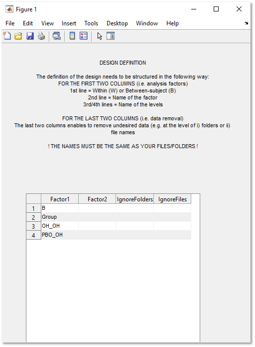
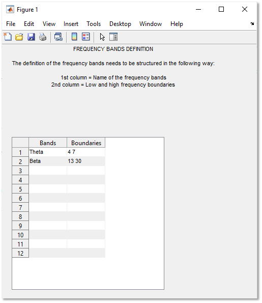
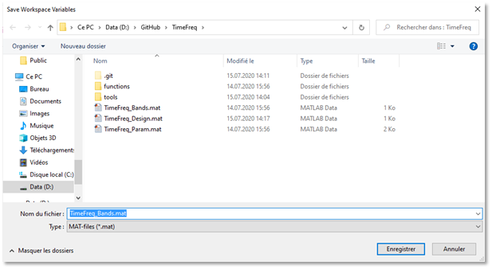

# EEG Time-frequency analysis scripts

The MATLAB scripts in this repository enable to compute EEG time-frequency decomposition as well as robust, permutation-based statistical analysis of simple designs (up to 1 within-subject and 1 between-subject factors). 

**OF NOTE: The main analysis script can currently only import .set EEG files (i.e. [EEGLAB](https://github.com/sccn/eeglab) files).**

## Getting Started

Start by clicking on `Code` on the top right of the screen and then `Download ZIP` to download the whole repository (alternatively you can also clone it). 
Then, you will need to run the scripts **in the following order**:

```
1.TimeFreq_Design.m
2.TimeFreq_Main.m
3.TimeFreq_Figures.m (optional and still in development)
```

You will find below a step by step explanation on how to run each script.


### 1.TimeFreq_Design.m

This script is the crucial to the proper functioning of the analysis. 

Start by running the script in MATLAB (click on the `Run` button or on your keyboard's button `F5`).

The 7 prompts below will appear sequentially and each prompt will already be filled with default settings and/or examples on how they should be filled: 


#### 1.1. Settings


The first prompt enables to set up parameters regarding the time-frequency decomposition.

You can decide to compute 1) `Evoked activity`, 2) `Induced activity` and/or 3) `Intertrial coherence`.\
For a deeper understanding between these three measures see:\
**REFS**

Additionally, you can either import a `TimeFreq_Design.mat` and/or a `TimeFreq_Bands.mat` files (Y)  or create new ones (N).

Finally, you can decide to :
```
* Average reference your EEG files before the time-frequency decomposition
* Restrict the time-window for statistics inside the time-range of your ERP
* Apply a power spectrum normalization as routinely performed by [EEGLAB](https://github.com/sccn/eeglab) (i.e. 10 x Log10)
```


#### 1.2. Inputs ERP


The second prompt enables to define EEG files-specific settings.

Hence, you will have to provide the prompt with:
```
* The sampling rate of your EEG files (**all files should have the same sampling rate**)
* The 1) lowest and 2) highest frequency of interest for the time-frequency decomposition 
* The number of permutations to compute robust, non-parametric statistics (i.e. the higher the number of permutations, the slower the computation)
* The alpha threshold for statistics
* The relative tolerance level (i.e. for additional information see: **REF**; that number should be increased if you are targetting very low frequencies)
```


#### 1.3. Design Definition



The third prompt enables the definition of the statistical design.

These are the designs that are currently accepted:
```
* 1 between-subjects factor
* 1 within-subjects factor
* 1 between- & 1 within-subjects factors
* 2 between-subjects factors
```
There can only be **up to 2 levels for each factor !**

There is already an example that shows you how to fill the first two columns, namely on the... :
```
* First line you should indicate whether Factor1 is a Between-subjects (B) or Within-subjects (W) factor
* Second line you should give a name to the Factor
* Third and fourth lines you need to define the name of each levels.\
```
**The last point is case-sensitive since the name you pick as levels should match either a pattern in your EEG files or the name of subfolders in which you separated the files.**

Additionally, you have the possibility to ignore specific `folder(s)` and/or `file(s)` that are inside the EEG files-containing upper folder.\
For example, if you would like to ignore every EEG files that contains the pattern `_EXCLUDE`, just write this pattern in the first box under the `IgnoreFiles` header.

**Once you are done, press on the cross `X` on the top-right corner and the code will resume**


#### 1.4. Save Design Variables


The fourth prompt asks you to provide a path were to save the **TimeFreq_Design.mat** file containing the design definition variables (can be directly re-imported next time).


#### 1.5. Frequency Bands Definition



The fifth prompt enables to defined up to twelve frequency bands of interest. 

For each band of interest, you need to provide a name in the first column `Bands` and then the lower and upper frequency bounds for that band in the `Boundaries` column. 

**Once you are done, press on the cross `X` on the top-right corner and the code will resume**


#### 1.6. Save Frequency Bands Variables



The sixth prompt asks you to provide a path were to save the **TimeFreq_Bands.mat** file containing the frequency bands definition variables (can be directly re-imported next time).


#### 1.7. Import TF Decomposition


The last prompt enables you to import a time-frequency decomposition previously generated by the second script.

Since the decomposition requires heavy computation and is, de facto, time-consuming, you can decide to reimport the decomposition if you just want to perform the statistics separately (in this case press `Yes`).


Once you are done with this last prompt, the script will generate a `TimeFreq_Param.mat` file containing all the parameters necessary for the second script.

You can now run the second script. 


## Dependencies


## Author

**Corentin Wicht**\
*SNSF Doc.CH PhD student*\
*corentin.wicht@unifr.ch, corentinw.lcns@gmail.com*
*[Laboratory for Neurorehabilitation Science](https://www3.unifr.ch/med/spierer/en/)*\
*University of Fribourg, Switzerland*\

## License

This project is licensed under the XXX License - see the [LICENSE.md](LICENSE.md) file for details
 
## Versions

XXX
